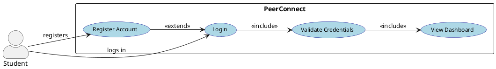
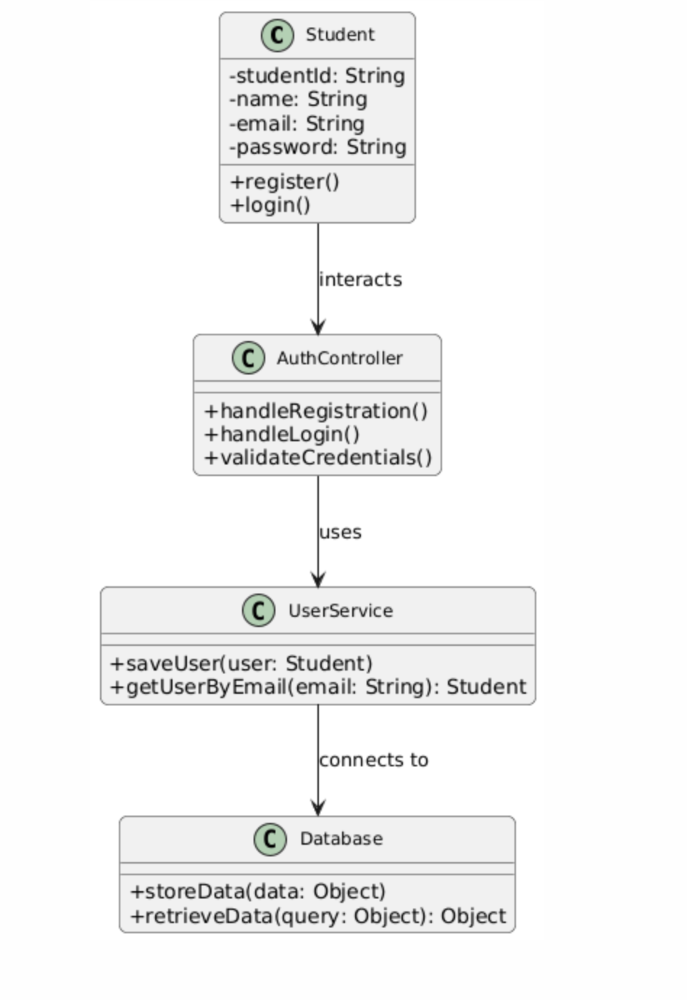
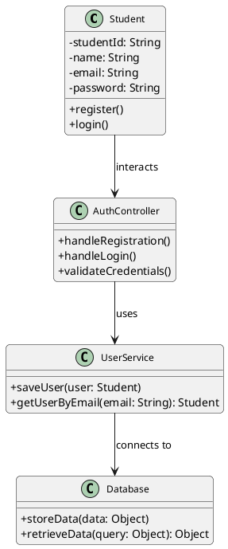
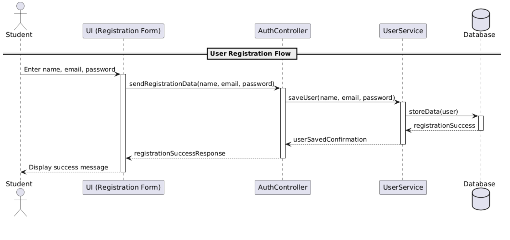
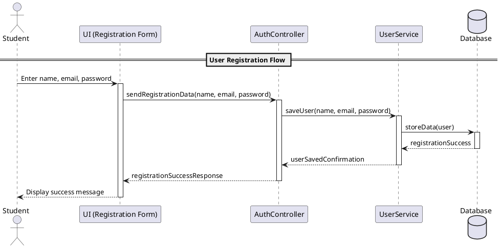
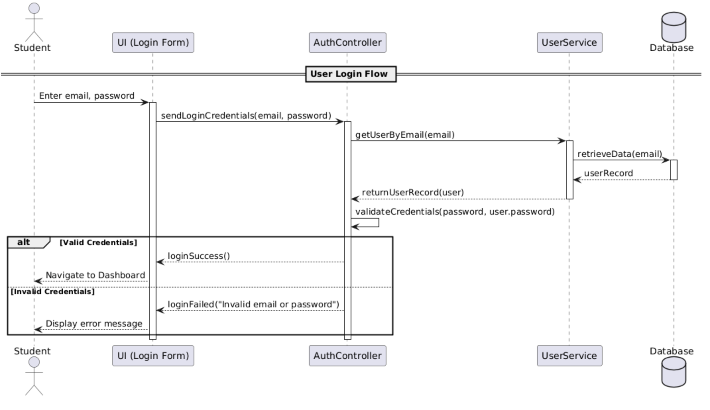
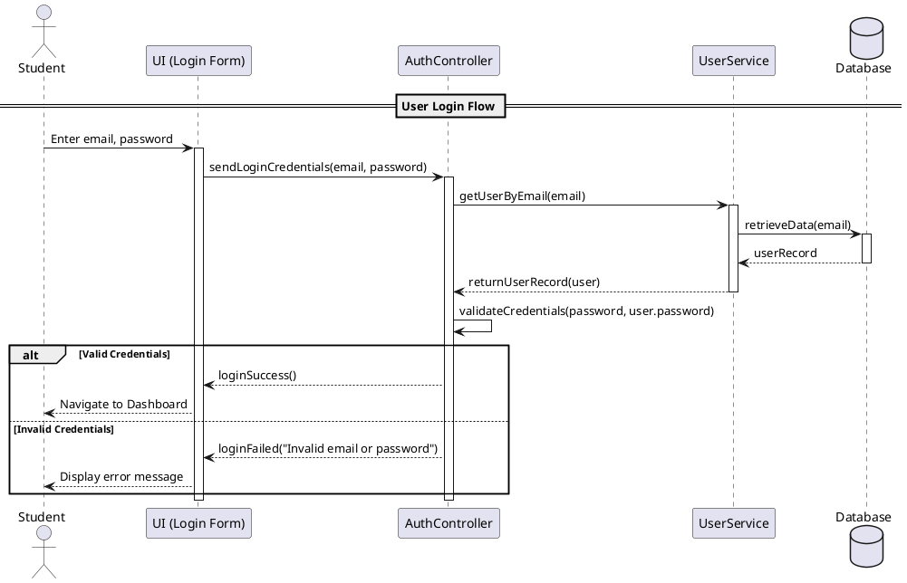

## 🧩 Design Phase (Sprint 1 – Authentication Module)

### 🎯 Use Case Diagram

---

#### 🧠 Code

---

### 🎯 Class Diagram

---

#### 🧠 Code

---

### 🎯 Sequence Diagram Flow 1: User Registration

---

#### 🧠 Code

---
### 🎯 Sequence Diagram Flow 2: User Login

---

#### 🧠 Code

---
