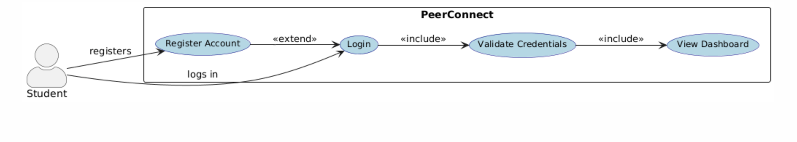

## 🧩 Design Phase

### 🎯 Use Case Diagram

---


#### 🧠 Code

```plantuml
@startuml
left to right direction
skinparam actorStyle awesome
skinparam usecase {
  BackgroundColor LightBlue
  BorderColor DarkBlue
  FontSize 12
  FontColor Black
}

actor "Student" as student

rectangle "PeerConnect" {
    usecase "Register Account" as UC1
    usecase "Login" as UC2
    usecase "Validate Credentials" as UC3
    usecase "View Dashboard" as UC4
}

' Relationships
student --> UC1 : registers
student --> UC2 : logs in

UC2 --> UC3 : <<include>>
UC3 --> UC4 : <<include>>
UC1 --> UC2 : <<extend>>

@enduml
